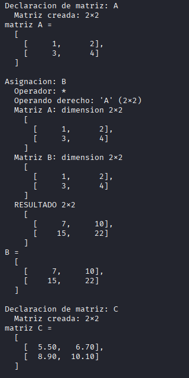
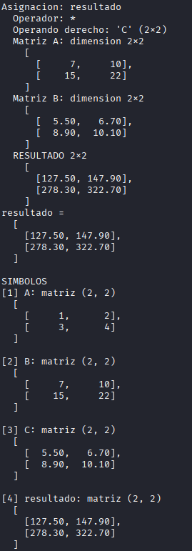
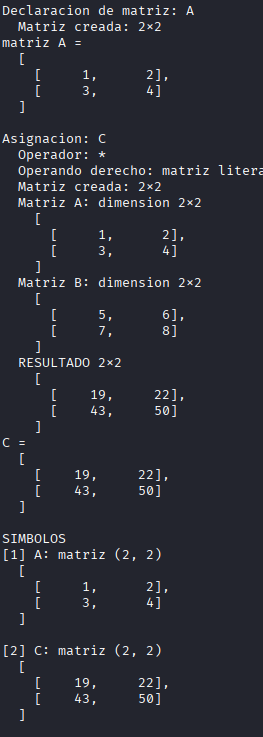

# Parser de Producto de Matrices con ANTLR4

## Instalación

1. Crear entorno virtual:
```bash
python3 -m venv venv
source venv/bin/activate
pip install antlr4-python3-runtime
```

2. Generar los archivos del parser:
```bash
antlr4 -Dlanguage=Python3 -visitor MatrizProducto.g4
```

## Uso

### Manualmente
```bash
source venv/bin/activate
python main.py archivo.txt
```

## Ejemplo

```
matriz A = [[1, 2], [3, 4]]
B = A * A
matriz C = [[5.5, 6.7], [8.9, 10.1]]
resultado = B * C
```
# Resultado



## Ejemplo 2
```
matriz A = [[1, 2], [3, 4]]
C = A * [[5, 6], [7, 8]]
```
# Resultado
